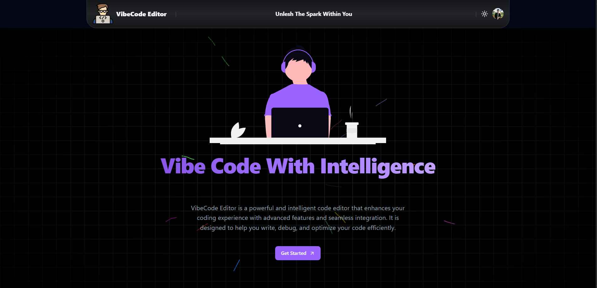

# 🧠 Vibecode Editor – AI-Powered Web IDE



<p align="center">
  <!-- Core Frameworks -->
  <a href="https://nextjs.org"></a>
  <a href="https://www.typescriptlang.org/"></a>
  <a href="https://tailwindcss.com"></a>
  <a href="https://ui.shadcn.com/"></a>
  <br>
  <!-- Editor & Runtime -->
  <a href="https://microsoft.github.io/monaco-editor/"></a>
  <a href="https://webcontainers.io/"></a>
  <a href="https://xtermjs.org/"></a>
  <br>
  <!-- AI / Backend -->
  <a href="https://ollama.com/"></a>
  <a href="https://expressjs.com/"></a>
  <a href="https://hono.dev/"></a>
  <br>
  <!-- Database & Auth -->
  <a href="https://www.mongodb.com/"></a>
  <a href="https://next-auth.js.org/"></a>
  <br>
  <!-- Testing & Utilities -->
  <a href="[[https://chai.js.org/](https://www.youtube.com/@HiteshCodeLab)](https://www.youtube.com/@HiteshCodeLab)"></a>
  <br>
  <!-- Deployment & License -->
  <a href="https://vercel.com/"></a>
  <a href="https://github.com/sudhanvapops/vibecodeeditor/blob/main/LICENSE"></a>
</p>


**Vibecode Editor** is a blazing-fast, AI-integrated web IDE built entirely in the browser using **Next.js App Router**, **WebContainers**, **Monaco Editor**, and **local LLMs via Ollama**. It offers real-time code execution, an AI-powered chat assistant, and support for multiple tech stacks — all wrapped in a stunning developer-first UI.

[Features](#-features) • [Tech Stack](#-tech-stack) • [Getting-Started](#-getting-started) • [Roadmap](#-roadmap) • [Contributing](#-contributing)

---

## 🚀 Features

- 🔐 **OAuth Login with NextAuth** – Supports Google & GitHub login.
- 🎨 **Modern UI** – Built with TailwindCSS & ShadCN UI.
- 🌗 **Dark/Light Mode** – Seamlessly toggle between themes.
- 🧱 **Project Templates** – Choose from React, Next.js, Express, Hono, Vue, or Angular.
- 🗂️ **Custom File Explorer** – Create, rename, delete, and manage files/folders easily.
- 🖊️ **Enhanced Monaco Editor** – Syntax highlighting, formatting, keybindings, and AI autocomplete.
- 💡 **AI Suggestions with Ollama** – Local models give you code completion on `Ctrl + Space` or double `Enter`. Accept with `Tab`.
- ⚙️ **WebContainers Integration** – Instantly run frontend/backend apps right in the browser.
- 💻 **Terminal with xterm.js** – Fully interactive embedded terminal experience.
- 🤖 **AI Chat Assistant** – Share files with the AI and get help, refactors, or explanations.

---

## 🧱 Tech Stack

| Layer         | Technology                                   |
|---------------|----------------------------------------------|
| Framework     | Next.js 15 (App Router)                      |
| Styling       | TailwindCSS, ShadCN UI                       |
| Language      | TypeScript                                   |
| Auth          | NextAuth (Google + GitHub OAuth)             |
| Editor        | Monaco Editor                                |
| AI Suggestion | Ollama (LLMs running locally via Docker)     |
| Runtime       | WebContainers                                |
| Terminal      | xterm.js                                     |
| Database      | MongoDB (via DATABASE_URL)                   |

---

## 🛠️ Getting Started

### 1. Clone the Repo

```bash
git clone https://github.com/sudhanvapops/vibecodeeditor
cd vibecodeeditor
```

### 2. Install Dependencies

```bash
yarn install
```

### 3. Set Up Environment Variables

Create a `.env.local` file using the template:

```bash
cp .env.sample .env.local
```

Then, fill in your credentials:

```env
AUTH_SECRET=your_auth_secret
AUTH_GOOGLE_ID=your_google_client_id
AUTH_GOOGLE_SECRET=your_google_secret
AUTH_GITHUB_ID=your_github_client_id
AUTH_GITHUB_SECRET=your_github_secret
DATABASE_URL=your_mongodb_connection_string
NEXTAUTH_URL=http://localhost:3000
```

### 4. Start Local Ollama Model

Make sure [Ollama](https://ollama.com/) and Docker are installed, then run:

```bash
ollama run codellama
```

Or use your preferred model that supports code generation.

### 5. Run the Development Server

```bash
yarn run dev
```

Visit `http://localhost:3000` in your browser.

---

## 📁 Project Structure

```
.
├── app/                     # App Router-based pages & routes
├── components/              # UI components
├── editor/                  # Monaco, File Explorer, Terminal
├── lib/                     # Utility functions
├── public/                  # static files (e.g., logo, thumbnail)
├── utils/                   # AI helpers, WebContainer logic
├── .env.sample              # Example env vars
└── README.md
```

---

## 🎯 Keyboard Shortcuts

| Action                       | Shortcut                         |
| ---------------------------- | -------------------------------- |
| Trigger AI Suggestion        | `Ctrl + Space` or `Double Enter` |
| Accept AI Suggestion         | `Tab`                            |
| Command Palette (if enabled) | `/`                              |


---

## ✅ Roadmap

* [x] Google & GitHub Auth via NextAuth
* [x] Multiple stack templates
* [x] Monaco Editor + AI
* [x] WebContainers + terminal
* [x] AI chat for code assistance
* [ ] GitHub repo import/export
* [ ] Save/load playground from DB
* [ ] Real-time collaboration
* [ ] Plugin system for templates/tools
* [ ] One-click deploy via Vercel/Netlify


---

## 📄 License

This project is licensed under the [MIT License](LICENSE).

---

## 🙏 Acknowledgements

* [Monaco Editor](https://microsoft.github.io/monaco-editor/)
* [Ollama](https://ollama.com/) – for offline LLMs
* [WebContainers](https://webcontainers.io/)
* [xterm.js](https://xtermjs.org/)
* [NextAuth.js](https://next-auth.js.org/)

---
### ✨ Built with ❤️ by [Sudhanva S](https://github.com/sudhanvapops)
